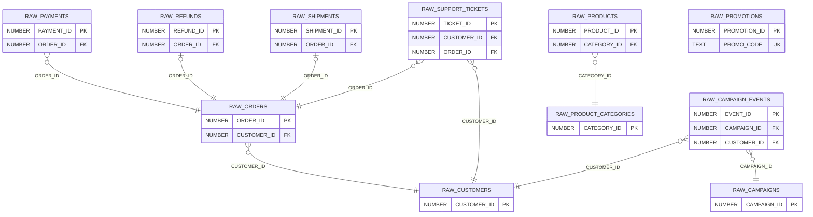

# Schema analysis: SWT_BERLIN_2026.PUBLIC

- **Target:** `SWT_BERLIN_2026.PUBLIC`
- **Generated:** 2026-09-27T10:12:07Z
- **Scope:** 11 base tables, 68 columns, 26,753 rows, all profiled in full (no sampling)
- **Contract for other plugins:** [analysis.json](analysis.json)

## Summary

`SWT_BERLIN_2026.PUBLIC` is the raw layer of an e-commerce business with a marketing add-on. `RAW_ORDERS` is the hub: payments, refunds, shipments and support tickets hang off it, and `RAW_CUSTOMERS` is the shared dimension for orders, tickets and campaign events. Products are a snowflaked dimension (`RAW_PRODUCTS` → `RAW_PRODUCT_CATEGORIES`), campaigns carry a click stream (`RAW_CAMPAIGN_EVENTS`), and `RAW_PROMOTIONS` is standalone. Nothing is declared, but every table has a clean single-column `*_ID` key, and all 9 inferred foreign keys match 100% with zero orphans. Referential integrity is sound; business consistency is not. Ticket `CUSTOMER_ID` disagrees with the order's customer on 99.5% of order-linked tickets. Successful payments do not add up to the order amount for 30% of orders. A quarter of orders predate the customer's signup. 9 of 20 campaigns and 13 of 30 promotions end before they start. The fact tables are fresh (0–8 days old). Products (62 days) and promotions (41 days) have had no new rows recently, and there is no order-line table, so products never connect to sales.

## Tables

| Table | Role | Rows | PK | Freshness column | Latest value | Days since latest |
|---|---|---:|---|---|---|---:|
| RAW_CAMPAIGNS | dimension | 20 | CAMPAIGN_ID | START_DATE | 2026-08-31 | 27 |
| RAW_CAMPAIGN_EVENTS | fact | 10,000 | EVENT_ID | EVENT_TIMESTAMP | 2026-09-27 01:34:21 -07:00 | 0 |
| RAW_CUSTOMERS | dimension | 500 | CUSTOMER_ID | SIGNUP_DATE | 2026-08-26 | 32 |
| RAW_ORDERS | fact | 5,000 | ORDER_ID | ORDER_DATE | 2026-09-24 | 3 |
| RAW_PAYMENTS | fact | 5,737 | PAYMENT_ID | PAYMENT_DATE | 2026-09-24 23:20:00 | 3 |
| RAW_PRODUCTS | dimension | 200 | PRODUCT_ID | CREATED_DATE | 2026-07-27 | 62 |
| RAW_PRODUCT_CATEGORIES | dimension | 15 | CATEGORY_ID | none (no date column) | – | – |
| RAW_PROMOTIONS | standalone | 30 | PROMOTION_ID | START_DATE | 2026-08-17 | 41 |
| RAW_REFUNDS | fact | 356 | REFUND_ID | REFUND_DATE | 2026-09-19 | 8 |
| RAW_SHIPMENTS | fact | 4,095 | SHIPMENT_ID | SHIPPED_DATE | 2026-09-27 | 0 |
| RAW_SUPPORT_TICKETS | fact | 800 | TICKET_ID | CREATED_AT | 2026-09-25 | 2 |

All primary keys are inferred (not null, unique). No constraints are declared and every column is declared nullable, so Snowflake enforces none of this. Freshness skips closing and planned dates (`END_DATE`, `DELIVERED_DATE`, `RESOLVED_AT`), several of which contain future values. Days are measured from `CURRENT_DATE()` = 2026-09-27.

## Entity-relationship diagram

## Relationships

| From | To | Cardinality | Optional | Match % | Orphans | Parents covered | Confidence |
|---|---|---|---|---:|---:|---|---|
| RAW_CAMPAIGN_EVENTS.CAMPAIGN_ID | RAW_CAMPAIGNS.CAMPAIGN_ID | many-to-one | no | 100.0 | 0 | 20 / 20 | high |
| RAW_CAMPAIGN_EVENTS.CUSTOMER_ID | RAW_CUSTOMERS.CUSTOMER_ID | many-to-one | yes (39.96% null) | 100.0 | 0 | 500 / 500 | high |
| RAW_ORDERS.CUSTOMER_ID | RAW_CUSTOMERS.CUSTOMER_ID | many-to-one | no | 100.0 | 0 | 500 / 500 | high |
| RAW_PAYMENTS.ORDER_ID | RAW_ORDERS.ORDER_ID | many-to-one | no | 100.0 | 0 | 5,000 / 5,000 | high |
| RAW_PRODUCTS.CATEGORY_ID | RAW_PRODUCT_CATEGORIES.CATEGORY_ID | many-to-one | no | 100.0 | 0 | 15 / 15 | high |
| RAW_REFUNDS.ORDER_ID | RAW_ORDERS.ORDER_ID | one-to-one | no | 100.0 | 0 | 356 / 5,000 | high |
| RAW_SHIPMENTS.ORDER_ID | RAW_ORDERS.ORDER_ID | one-to-one | no | 100.0 | 0 | 4,095 / 5,000 | high |
| RAW_SUPPORT_TICKETS.CUSTOMER_ID | RAW_CUSTOMERS.CUSTOMER_ID | many-to-one | no | 100.0 | 0 | 394 / 500 | high |
| RAW_SUPPORT_TICKETS.ORDER_ID | RAW_ORDERS.ORDER_ID | many-to-one | yes (30.38% null) | 100.0 | 0 | 526 / 5,000 | high |

- 9 relationships: 9 high, 0 medium, 0 low. All inferred by name + key match and validated with an orphan check.
- "One-to-one" means each child row points at a different parent; a parent has zero or one child.
- Links that do not exist: orders have no `PRODUCT_ID` (no order lines), no promotion/promo code, and events have no `ORDER_ID`. So products, promotions and conversions cannot be joined to revenue.

## Consistency checks

Orphan checks only prove each key on its own. These checks test business rules that span columns or tables.

| Rule | Result | Status |
|---|---|---|
| Ticket `CUSTOMER_ID` = customer of the ticket's `ORDER_ID` | 554 of 557 order-linked tickets disagree | FAIL |
| Ticket `CREATED_AT` ≥ order `ORDER_DATE` | 191 of 557 are earlier | FAIL |
| Closed/Resolved tickets have `RESOLVED_AT` | 87 of 389 missing | FAIL |
| Open/In Progress tickets have no `RESOLVED_AT` | 313 of 411 have one | FAIL |
| Open/In Progress tickets have no `SATISFACTION_SCORE` | 411 of 411 have one | WARN |
| `RESOLVED_AT` ≥ `CREATED_AT` | 0 violations | PASS |
| `RESOLVED_AT` not in the future | 6 in the future | FAIL |
| `ORDER_DATE` ≥ customer `SIGNUP_DATE` | 1,203 of 5,000 earlier (221 customers, up to 503 days) | FAIL |
| SUCCESS payments sum to order `AMOUNT` | 1,496 of 5,000 differ (1,272 COMPLETED) | FAIL |
| COMPLETED orders have a SUCCESS payment | 205 of 4,286 have none | FAIL |
| CANCELLED orders are not charged, or are refunded | 449 of 471 charged, 0 refunded | FAIL |
| `PAYMENT_DATE` ≥ `ORDER_DATE` | 0 violations | PASS |
| (`ORDER_ID`, `PAYMENT_SEQ`) unique | 0 duplicates | PASS |
| `REFUND_AMOUNT` ≤ order `AMOUNT` | 0 violations | PASS |
| `REFUND_AMOUNT` ≤ amount successfully paid | 42 exceed (including 15 on orders never paid successfully) | FAIL |
| Refunds only on COMPLETED orders | 0 violations | PASS |
| `REFUND_DATE` ≥ `ORDER_DATE` | 0 violations | PASS |
| No shipments for CANCELLED orders | 0 violations | PASS |
| PENDING orders not yet shipped | 226 of 243 shipped, 220 already delivered | FAIL |
| COMPLETED orders have a shipment | 417 of 4,286 have none | WARN |
| `SHIPPED_DATE` ≥ `ORDER_DATE` | 0 violations | PASS |
| `DELIVERED_DATE` ≥ `SHIPPED_DATE` | 0 violations | PASS |
| `DELIVERED_DATE` not in the future | 57 in the future (51 COMPLETED, 6 PENDING) | WARN |
| Event, payment and ship dates not in the future | 0 violations | PASS |
| Event date within campaign `START_DATE`–`END_DATE` | 7,661 of 10,000 outside | FAIL |
| Event customer `REGION` = campaign `TARGET_REGION` | 4,508 of 6,004 differ | INFO |
| Campaign `END_DATE` ≥ `START_DATE` | 9 of 20 inverted | FAIL |
| Campaign `SPEND` ≤ `BUDGET` | 9 of 20 over budget | WARN |
| Promotion `END_DATE` ≥ `START_DATE` | 13 of 30 inverted | FAIL |
| Fixed Amount discount < `MIN_ORDER_AMOUNT` | 0 violations | PASS |
| Product `COST_PRICE` ≤ `LIST_PRICE` | 45 of 200 above | WARN |

## Table details

### RAW_CAMPAIGNS

- **Role:** dimension, referenced by RAW_CAMPAIGN_EVENTS
- **Grain:** one row per marketing campaign
- **Primary key:** `CAMPAIGN_ID` (inferred). `CAMPAIGN_NAME` is also unique.

| Column | Type | Null % | Distinct | Notes |
|---|---|---:|---:|---|
| CAMPAIGN_ID | NUMBER | 0.0 | 20 | PK; 1–20 |
| CAMPAIGN_NAME | TEXT | 0.0 | 20 | unique label, "Campaign 1" … "Campaign 20" |
| CHANNEL | TEXT | 0.0 | 6 | Affiliate, Display, Email, Influencer, Paid Search, Social Media |
| BUDGET | NUMBER | 0.0 | 20 | 1,717.80 – 46,598.38 |
| SPEND | NUMBER | 0.0 | 20 | 1,502.81 – 44,069.87 |
| START_DATE | DATE | 0.0 | 20 | 2025-10-05 → 2026-08-31; freshness column |
| END_DATE | DATE | 0.0 | 19 | 2025-11-28 → 2026-09-27 |
| TARGET_REGION | TEXT | 0.0 | 4 | APAC, EMEA, LATAM, North America |

**Data quality**
- 9 of 20 campaigns have `END_DATE` before `START_DATE`.
- 9 of 20 have `SPEND` > `BUDGET`; 6 campaigns have both problems.
- Only 2,339 of 10,000 events fall inside their campaign's window (see RAW_CAMPAIGN_EVENTS).
- `CAMPAIGN_NAME` gets an `accepted_values` list only because the table has ≤ 20 rows. Don't turn it into an enum test.

### RAW_CAMPAIGN_EVENTS

- **Role:** fact → RAW_CAMPAIGNS, RAW_CUSTOMERS
- **Grain:** one row per campaign event (impression 6,963 · click 2,613 · conversion 424)
- **Primary key:** `EVENT_ID` (inferred)

| Column | Type | Null % | Distinct | Notes |
|---|---|---:|---:|---|
| EVENT_ID | NUMBER | 0.0 | 10,000 | PK; 1–10,000 |
| CAMPAIGN_ID | NUMBER | 0.0 | 20 | FK → RAW_CAMPAIGNS |
| CUSTOMER_ID | NUMBER | 39.96 | 500 | FK → RAW_CUSTOMERS (optional) |
| EVENT_TYPE | TEXT | 0.0 | 3 | click, conversion, impression |
| EVENT_TIMESTAMP | TIMESTAMP_LTZ | 0.0 | 9,997 | 2025-09-27 02:00:51 → 2026-09-27 01:34:21 (UTC-07:00); freshness column |
| DEVICE_TYPE | TEXT | 0.0 | 3 | desktop, mobile, tablet |

**Data quality**
- `CUSTOMER_ID` is null for 3,996 events (39.96%), including 161 of 424 conversions (38%). Anonymous impressions are expected; anonymous conversions can't be attributed.
- Only 2,339 events (23.4%) fall inside the campaign's `START_DATE`–`END_DATE`. 4,482 belong to the 9 campaigns with inverted dates; 3,179 fall outside a valid window.
- 4,508 of 6,004 identified events (75.1%) reach customers outside the campaign's `TARGET_REGION`. That's roughly what random assignment across 4 regions gives, so `TARGET_REGION` isn't reflected in delivery (informational).
- `EVENT_TIMESTAMP` is `TIMESTAMP_LTZ`; dates above are in the session time zone (UTC-07:00). Other tables use `TIMESTAMP_NTZ`/`DATE`, so normalize to UTC in staging.
- No `ORDER_ID`, so conversions can't be tied to orders.

### RAW_CUSTOMERS

- **Role:** dimension, referenced by RAW_ORDERS (all 500 customers), RAW_SUPPORT_TICKETS (394) and RAW_CAMPAIGN_EVENTS (500)
- **Grain:** one row per customer
- **Primary key:** `CUSTOMER_ID` (inferred). `CUSTOMER_NAME` is also unique.

| Column | Type | Null % | Distinct | Notes |
|---|---|---:|---:|---|
| CUSTOMER_ID | NUMBER | 0.0 | 500 | PK; 1–500 |
| CUSTOMER_NAME | TEXT | 0.0 | 500 | unique |
| REGION | TEXT | 0.0 | 4 | APAC, EMEA, LATAM, North America |
| SEGMENT | TEXT | 0.0 | 3 | Enterprise, Mid-Market, SMB |
| SIGNUP_DATE | DATE | 0.0 | 385 | 2024-01-03 → 2026-08-26; freshness column |

**Data quality**
- 221 customers (44%) have orders dated before `SIGNUP_DATE`: 1,203 orders, up to 503 days early. `SIGNUP_DATE` may not be the real account-creation date.
- No signups in the last 32 days, while orders are 3 days old. Check that the customer feed is still loading.

### RAW_ORDERS

- **Role:** fact → RAW_CUSTOMERS; referenced by RAW_PAYMENTS (every order), RAW_SHIPMENTS (4,095), RAW_SUPPORT_TICKETS (526) and RAW_REFUNDS (356)
- **Grain:** one row per order
- **Primary key:** `ORDER_ID` (inferred)

| Column | Type | Null % | Distinct | Notes |
|---|---|---:|---:|---|
| ORDER_ID | NUMBER | 0.0 | 5,000 | PK; 1–5,000 |
| CUSTOMER_ID | NUMBER | 0.0 | 500 | FK → RAW_CUSTOMERS |
| ORDER_DATE | DATE | 0.0 | 538 | 2025-04-05 → 2026-09-24; freshness column |
| STATUS | TEXT | 0.0 | 3 | COMPLETED 4,286 · CANCELLED 471 · PENDING 243 |
| AMOUNT | NUMBER | 0.0 | 4,949 | 20.11 – 2,000.94 |

**Data quality**
- 1,203 orders (24.1%) are dated before the customer's `SIGNUP_DATE`.
- SUCCESS payments don't sum to `AMOUNT` for 1,496 orders (29.9%), 1,272 of them COMPLETED. 205 COMPLETED orders have no successful payment at all.
- 449 of 471 CANCELLED orders have a SUCCESS payment and no refund.
- 226 of 243 PENDING orders already have a shipment, and 220 of those are delivered. `STATUS` looks stale.
- 417 COMPLETED orders (9.7%) have no shipment. That may be fine if there are digital or pickup orders; confirm.

### RAW_PAYMENTS

- **Role:** fact → RAW_ORDERS
- **Grain:** one row per payment attempt. (`ORDER_ID`, `PAYMENT_SEQ`) is unique; 4,263 orders have one payment, 737 have two.
- **Primary key:** `PAYMENT_ID` (inferred)

| Column | Type | Null % | Distinct | Notes |
|---|---|---:|---:|---|
| PAYMENT_ID | NUMBER | 0.0 | 5,737 | PK; 1–5,737 |
| ORDER_ID | NUMBER | 0.0 | 5,000 | FK → RAW_ORDERS |
| PAYMENT_SEQ | NUMBER | 0.0 | 2 | 1–2; unique together with ORDER_ID |
| PAYMENT_METHOD | TEXT | 0.0 | 5 | Credit Card, Debit Card, Gift Card, PayPal, Wire Transfer |
| PAYMENT_AMOUNT | NUMBER | 0.0 | 5,648 | 8.45 – 2,000.94 |
| PAYMENT_DATE | TIMESTAMP_NTZ | 0.0 | 5,716 | 2025-04-05 00:23 → 2026-09-24 23:20; freshness column |
| PAYMENT_STATUS | TEXT | 0.0 | 2 | SUCCESS 5,412 · FAILED 325 |

**Data quality**
- Payments don't reconcile to orders. 577 of 4,263 single-payment orders are paid below `AMOUNT`, and 686 of 737 two-payment orders total more than `AMOUNT`.
- 648 orders have two SUCCESS payments and 87 have one FAILED plus one SUCCESS. Confirm whether a second payment is a split, a retry or a duplicate before summing revenue.
- 236 orders have no SUCCESS payment (205 of them COMPLETED).
- No payment is dated before its order.

### RAW_PRODUCTS

- **Role:** dimension (snowflaked) → RAW_PRODUCT_CATEGORIES; nothing references it
- **Grain:** one row per product
- **Primary key:** `PRODUCT_ID` (inferred). `PRODUCT_NAME` is also unique.

| Column | Type | Null % | Distinct | Notes |
|---|---|---:|---:|---|
| PRODUCT_ID | NUMBER | 0.0 | 200 | PK; 1–200 |
| PRODUCT_NAME | TEXT | 0.0 | 200 | unique |
| CATEGORY_ID | NUMBER | 0.0 | 15 | FK → RAW_PRODUCT_CATEGORIES |
| LIST_PRICE | NUMBER | 0.0 | 200 | 5.38 – 494.20 |
| COST_PRICE | NUMBER | 0.0 | 200 | 2.60 – 249.97 |
| CREATED_DATE | DATE | 0.0 | 180 | 2024-07-19 → 2026-07-27; freshness column |
| IS_ACTIVE | BOOLEAN | 0.0 | 2 | true 171 · false 29 |

**Data quality**
- 45 products (22.5%) have `COST_PRICE` > `LIST_PRICE`.
- `MARGIN_TIER` (on the category) doesn't match product margins: every tier has negative-margin products (High Margin 20 of 71, Medium 11 of 63, Low 14 of 66).
- No table references products (no order-line table), so product and category analysis can't be tied to sales.
- No product created in the last 62 days.

### RAW_PRODUCT_CATEGORIES

- **Role:** dimension, referenced by RAW_PRODUCTS (all 15 categories used)
- **Grain:** one row per product category
- **Primary key:** `CATEGORY_ID` (inferred). `CATEGORY_NAME` is also unique.

| Column | Type | Null % | Distinct | Notes |
|---|---|---:|---:|---|
| CATEGORY_ID | NUMBER | 0.0 | 15 | PK; 1–15 |
| CATEGORY_NAME | TEXT | 0.0 | 15 | unique label (Automotive … Toys) |
| MARGIN_TIER | TEXT | 0.0 | 3 | High Margin, Low Margin, Medium Margin |

**Data quality**
- No date or timestamp column, so freshness can't be tracked.
- `MARGIN_TIER` is inconsistent with product margins (see RAW_PRODUCTS).
- `CATEGORY_NAME` gets an `accepted_values` list only because the table has ≤ 20 rows. Don't turn it into an enum test.

### RAW_PROMOTIONS

- **Role:** standalone
- **Grain:** one row per promotion
- **Primary key:** `PROMOTION_ID` (inferred). `PROMO_CODE` is unique and is the natural key.
- **Why it can't be joined:** looks like the promotion / discount-code catalog, but no table has `PROMOTION_ID` or `PROMO_CODE`, and `RAW_ORDERS` doesn't record an applied promotion or discount. The only link would be a fuzzy match on order date and `MIN_ORDER_AMOUNT`, which isn't a key.

| Column | Type | Null % | Distinct | Notes |
|---|---|---:|---:|---|
| PROMOTION_ID | NUMBER | 0.0 | 30 | PK; 1–30 |
| PROMO_CODE | TEXT | 0.0 | 30 | unique; natural key |
| DISCOUNT_TYPE | TEXT | 0.0 | 4 | Percentage 9 · Buy One Get One 8 · Fixed Amount 7 · Free Shipping 6 |
| DISCOUNT_VALUE | NUMBER | 0.0 | 25 | 5 – 92 |
| START_DATE | DATE | 0.0 | 28 | 2025-10-04 → 2026-08-17; freshness column |
| END_DATE | DATE | 0.0 | 29 | 2025-10-25 → 2026-10-18 |
| MIN_ORDER_AMOUNT | NUMBER | 0.0 | 29 | 86 – 489 |

**Data quality**
- 13 of 30 promotions (43%) have `END_DATE` before `START_DATE`.
- `DISCOUNT_VALUE` is filled in for Buy One Get One (5–69) and Free Shipping (12–87), where a number has no obvious meaning. Percentage goes up to 92.
- No promotion started in the last 41 days; only 1 is still running.

### RAW_REFUNDS

- **Role:** fact → RAW_ORDERS (one-to-one)
- **Grain:** one row per refund; at most one per order
- **Primary key:** `REFUND_ID` (inferred). `ORDER_ID` is also unique.

| Column | Type | Null % | Distinct | Notes |
|---|---|---:|---:|---|
| REFUND_ID | NUMBER | 0.0 | 356 | PK; 1–356 |
| ORDER_ID | NUMBER | 0.0 | 356 | FK → RAW_ORDERS; unique |
| REFUND_DATE | DATE | 0.0 | 252 | 2025-04-15 → 2026-09-19; freshness column |
| REFUND_AMOUNT | NUMBER | 0.0 | 355 | 9.79 – 1,975.26 |

**Data quality**
- Passed: every refund is on a COMPLETED order, ≤ the order `AMOUNT`, and dated on or after the order.
- 15 refunds are for orders with no successful payment, and 42 exceed the amount that was actually paid.

### RAW_SHIPMENTS

- **Role:** fact → RAW_ORDERS (one-to-one)
- **Grain:** one row per shipment; at most one per order
- **Primary key:** `SHIPMENT_ID` (inferred). `ORDER_ID` is also unique.

| Column | Type | Null % | Distinct | Notes |
|---|---|---:|---:|---|
| SHIPMENT_ID | NUMBER | 0.0 | 4,095 | PK; 1–4,095 |
| ORDER_ID | NUMBER | 0.0 | 4,095 | FK → RAW_ORDERS; unique |
| SHIPPED_DATE | DATE | 0.0 | 540 | 2025-04-05 → 2026-09-27; freshness column |
| DELIVERED_DATE | DATE | 0.0 | 548 | 2025-04-08 → 2026-10-08 |
| SHIPPING_METHOD | TEXT | 0.0 | 4 | Economy, Express, Overnight, Standard |
| CARRIER | TEXT | 0.0 | 4 | DHL, FedEx, UPS, USPS |
| SHIPPING_COST | NUMBER | 0.0 | 1,912 | 3.00 – 25.99 |

**Data quality**
- 57 shipments have a `DELIVERED_DATE` in the future (latest 2026-10-08), 51 of them on COMPLETED orders. `DELIVERED_DATE` is never null, even for today's shipments, so it's probably an estimated date.
- 226 shipments are for PENDING orders; 220 of them are already delivered.
- Passed: no shipments for CANCELLED orders; nothing ships before its order date or is delivered before it ships.

### RAW_SUPPORT_TICKETS

- **Role:** fact → RAW_CUSTOMERS, RAW_ORDERS
- **Grain:** one row per support ticket
- **Primary key:** `TICKET_ID` (inferred)

| Column | Type | Null % | Distinct | Notes |
|---|---|---:|---:|---|
| TICKET_ID | NUMBER | 0.0 | 800 | PK; 1–800 |
| CUSTOMER_ID | NUMBER | 0.0 | 394 | FK → RAW_CUSTOMERS |
| ORDER_ID | NUMBER | 30.38 | 526 | FK → RAW_ORDERS (optional) |
| CATEGORY | TEXT | 0.0 | 6 | Account, Billing, Product Quality, Returns, Shipping, Technical |
| PRIORITY | TEXT | 0.0 | 4 | Critical, High, Low, Medium |
| STATUS | TEXT | 0.0 | 4 | Open 213 · In Progress 198 · Closed 202 · Resolved 187 |
| CREATED_AT | DATE | 0.0 | 321 | 2025-09-27 → 2026-09-25; freshness column |
| RESOLVED_AT | TIMESTAMP_NTZ | 23.13 | 595 | 2025-09-28 00:00 → 2026-10-02 08:00 |
| SATISFACTION_SCORE | NUMBER | 0.0 | 5 | 1 – 5 |

**Data quality**
- **Conflicting paths:** on 554 of the 557 tickets that have an `ORDER_ID` (99.5%), `CUSTOMER_ID` doesn't match the order's `CUSTOMER_ID`. You get a different customer depending on the join path.
- 191 of 557 order-linked tickets were opened before the order date.
- Status and timestamps disagree: 87 Closed/Resolved tickets have no `RESOLVED_AT`, 313 Open/In Progress tickets have one, and 6 have a `RESOLVED_AT` in the future.
- `SATISFACTION_SCORE` is never null, including on all 411 Open/In Progress tickets.
- `ORDER_ID` is null on 243 tickets (30.4%), spread evenly across categories. That includes 111 Returns, Shipping and Product Quality tickets, which you'd expect to have an order.
- `CREATED_AT` is a `DATE` but `RESOLVED_AT` is `TIMESTAMP_NTZ`, so resolution time is only accurate to the day.

## Suggested next steps

1. **Key tests:** `unique` + `not_null` on the 11 primary keys. Add `unique` on `RAW_REFUNDS.ORDER_ID`, `RAW_SHIPMENTS.ORDER_ID` (keeps them one-to-one) and `RAW_PROMOTIONS.PROMO_CODE`, plus `dbt_utils.unique_combination_of_columns` on `RAW_PAYMENTS (ORDER_ID, PAYMENT_SEQ)`.
2. **Relationship tests** for all 9 high-confidence FKs. Add `not_null` on the 7 required FKs, but leave `RAW_CAMPAIGN_EVENTS.CUSTOMER_ID` and `RAW_SUPPORT_TICKETS.ORDER_ID` nullable.
3. **`accepted_values`** on the 16 low-cardinality TEXT columns in `analysis.json`. Skip `CAMPAIGN_NAME` and `CATEGORY_NAME`: they're unique labels, and their lists are only complete because the tables are small.
4. **Row-level tests** with `dbt_utils.expression_is_true`, severity `warn` to start, since several already fail:
   - `END_DATE >= START_DATE` on campaigns and promotions
   - `DELIVERED_DATE >= SHIPPED_DATE`
   - `RESOLVED_AT >= CREATED_AT`
   - `SATISFACTION_SCORE BETWEEN 1 AND 5`
   - `COST_PRICE <= LIST_PRICE`
   - positive amounts
5. **Singular tests for cross-table rules** from the consistency table:
   - ticket customer = order customer
   - `ORDER_DATE >= SIGNUP_DATE`
   - ticket status vs. `RESOLVED_AT` / `SATISFACTION_SCORE`
   - SUCCESS payments reconcile to `AMOUNT`
   - refunds ≤ amount paid
   - CANCELLED orders not charged
   - PENDING orders not delivered
6. **Source freshness:** use the fact freshness columns as `loaded_at_field` (`ORDER_DATE`, `PAYMENT_DATE`, `REFUND_DATE`, `SHIPPED_DATE`, `CREATED_AT`, `EVENT_TIMESTAMP`). The dimension columns (`SIGNUP_DATE`, `CREATED_DATE`, `START_DATE`) record when an entity was created, not when data loaded. Use loose thresholds there, or better, add an ingestion timestamp such as `_LOADED_AT` upstream. `RAW_PRODUCT_CATEGORIES` has no usable column at all.
7. **Staging normalization:**
   - convert `EVENT_TIMESTAMP` (LTZ) to UTC NTZ
   - give `CREATED_AT` and `RESOLVED_AT` the same type
   - pick one casing for enums (orders/payments use UPPERCASE, tickets and categories use Title Case, events use lowercase)
8. **Model layout:**
   - facts: `fct_orders` (with payment, refund and shipment rollups), `fct_payments`, `fct_shipments`, `fct_refunds`, `fct_support_tickets`, `fct_campaign_events`
   - dimensions: `dim_customers`, `dim_campaigns`, and `dim_products` with categories folded in
   - keep `RAW_PROMOTIONS` staging-only until orders record the promotion used
9. **Questions for data owners:**
   - What does a second payment mean: split, retry or duplicate?
   - Which customer is right on a ticket?
   - Is `DELIVERED_DATE` actual or estimated?
   - What defines `MARGIN_TIER`?
   - Why do so many campaigns and promotions end before they start?
   - Where would the order → product, order → promotion and conversion → order links come from?
